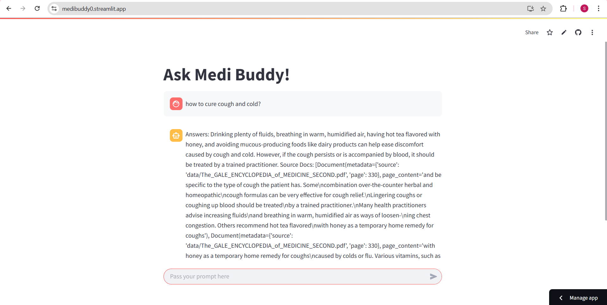

# Medi Buddy - AI-Powered Medical Chatbot

Medi Buddy is an AI-driven chatbot designed to provide reliable medical information. It is trained on the **Gale Encyclopedia** and utilizes **Langchain, Hugging Face models, FAISS (CPU)**, and **Streamlit** for seamless interactions.

## Features
- **Medical Knowledge Base**: Trained on Gale Encyclopedia for accurate medical information.
- **Conversational AI**: Uses `langchain` with Hugging Face models for natural language understanding.
- **Fast & Scalable Backend**: Built with Python.
- **Frontend UI**: Built with `Streamlit` for an interactive experience.
- **Vector Search**: Uses `FAISS (CPU)` for efficient retrieval of medical data.

## Tech Stack
- **Backend**: Python, Langchain, Hugging Face
- **Frontend**: Streamlit
- **Database**: FAISS (CPU) (Vector Database)

## Installation
```sh
# Clone the repository
git clone https://github.com/yourusername/medi-buddy.git
cd medi-buddy

# Install dependencies
pip install -r requirements.txt
```

## Usage
```sh
# Start the application
streamlit run medibot.py
```

## Screenshot


## Future Improvements
- Integration with live medical databases
- Support for multi-language queries
- Appointment booking system
